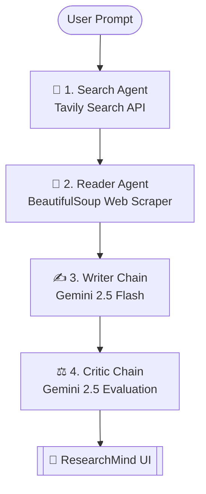

# 🧠 ResearchMind — Multi-Agent AI Research System

[](https://streamlit.io)
[](https://www.python.org/)
[](https://deepmind.google/technologies/gemini/)
[](https://www.langchain.com/)
[](LICENSE)

> **Four specialized AI agents work in concert — searching, scraping, writing, and critiquing — to deliver polished, in-depth research reports on any topic.**

ResearchMind is a premium, state-of-the-art multi-agent research assistant built using **Streamlit**, **LangChain**, and **Google's Gemini 2.5 Flash**. By combining the power of web search tools, scrapers, and structured LLM chains, it automates the laborious research lifecycle, transforming a simple prompt into an academic-grade report with critical evaluation scores.

---

## 🗺️ System Architecture & Workflow

ResearchMind orchestrates four distinct intelligence units to perform deep investigation:



1. **🔎 Search Agent**: Generates tailored search queries, scans the web using the Tavily Search API, and retrieves reliable metadata (Titles, Snippets, URLs). It includes automatic query sanitization and fallback fallback-logic.
2. **📄 Reader Agent**: Selects the most relevant resource and extracts up to 3,000 characters of clean text (excluding headers, footers, and scripts) using BeautifulSoup.
3. **✍️ Writer Chain**: Consolidates all gathered web snippets and scraped text to draft a comprehensive, structured markdown report (Introduction, Key Findings, Conclusion, Sources).
4. **⚖️ Critic Chain**: Acts as an objective reviewer, evaluating the report for factual consistency and depth, scoring it out of 10, outlining strengths and areas for improvement, and providing a final verdict.

---

## ✨ Key Features

*   **💎 Premium Glassmorphic UI**: Beautiful dark theme styled with custom Google Fonts (*Space Grotesk*, *Inter*, *JetBrains Mono*), ambient glowing gradient backdrops, animated noise overlays, and floating background orbs.
*   **📡 Real-Time Agent Progress Tracker**: Visual progress bar showing which agent is currently active, complete with step logs, status indicators, and execution time tracking.
*   **💻 Dual Execution Modes**:
    *   **Web App**: Complete interactive experience via Streamlit (`app.py`).
    *   **CLI Pipeline**: Rapid command-line research execution (`pipline.py`).
*   **⚙️ Smart Search Sanitizer**: Automatically cleans queries containing unsupported search operators (like `site:`) and retries searches automatically to ensure high reliability.
*   **🔒 Secure Secret Fallbacks**: Seamlessly switches between local `.env` variables and production Streamlit Cloud Secrets (`st.secrets`).

---

## 🛠️ Technology Stack

*   **Front-End**: [Streamlit](https://streamlit.io/) with custom CSS styling.
*   **Orchestration**: [LangChain](https://github.com/langchain-ai/langchain) & `langchain-core` for agent tools and chain piping.
*   **LLM Service**: [Google Gemini 2.5 Flash](https://deepmind.google/technologies/gemini/) via `langchain-google-genai` (optimized for speed and free-tier compatibility).
*   **Search**: [Tavily Search API](https://tavily.com/) for developer-friendly search results.
*   **Scraping**: `BeautifulSoup4` + `requests` + `lxml`.

---

## 📁 Project Structure

```
├── .streamlit/
│   └── config.toml       # Streamlit dark theme & layout configuration
├── agents.py             # Agent definitions & LangChain setup
├── app.py                # Premium Streamlit web UI & orchestration
├── pipline.py            # Command Line Interface (CLI) version
├── tools.py              # Custom tools (web_search, scrape_url)
├── requirements.txt      # Project dependencies
└── README.md             # Project documentation (this file)
```

---

## 🚀 Getting Started

### Prerequisites

*   Python 3.9 or higher
*   A **Google Gemini API Key** (Get one from [Google AI Studio](https://aistudio.google.com/))
*   A **Tavily Search API Key** (Get one from [Tavily](https://tavily.com/))

### Installation

1.  **Clone the Repository**:
    ```bash
    git clone https://github.com/prathamesh-6099/Multi-Agent-AI-Research-System.git
    cd Multi-Agent-AI-Research-System
    ```

2.  **Create and Activate Virtual Environment**:
    *   **Windows**:
        ```bash
        python -m venv .venv
        .venv\Scripts\activate
        ```
    *   **macOS / Linux**:
        ```bash
        python3 -m venv .venv
        source .venv/bin/activate
        ```

3.  **Install Dependencies**:
    ```bash
    pip install -r requirements.txt
    ```

4.  **Set Up Environment Secrets**:
    Create a file named `.env` in the root of the project and add your API keys:
    ```env
    GEMINI_API_KEY=your_gemini_api_key_here
    TAVILY_API_KEY=your_tavily_api_key_here
    ```

---

## 🖥️ How to Run

### Option 1: Streamlit Web UI (Recommended)
Run the Streamlit application to experience the high-end dashboard:
```bash
streamlit run app.py
```
This will spin up a local server, usually opening automatically at `http://localhost:8501`.

### Option 2: Command Line (CLI)
For a text-based, lightning-fast execution:
```bash
python pipline.py
```
You will be prompted to enter a topic, and the research stages will print directly in your terminal.

---

## ☁️ Streamlit Cloud Deployment

To host this application for free on Streamlit Community Cloud:

1.  Push the project to your GitHub repository.
2.  Log in to [Streamlit Share](https://share.streamlit.io/) and click **New app**.
3.  Select your repository, branch (`main`), and main file path (`app.py`).
4.  Expand the **Advanced settings** section.
5.  In the **Secrets** text area, paste your production API keys in TOML format:
    ```toml
    GEMINI_API_KEY = "your-actual-gemini-api-key"
    TAVILY_API_KEY = "your-actual-tavily-api-key"
    ```
6.  Click **Deploy**! The app will be built and launched online.

---

## 📄 License

This project is licensed under the MIT License - see the [LICENSE](LICENSE) file for details.
